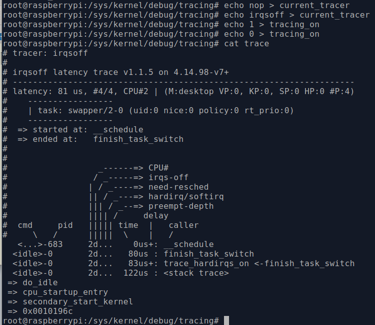

---

---

# ftrace使用方法

# 简介

ftrace最早出现于Linux 2.6.27版本中，主要用于跟踪各种延迟。ftrace通过debugfs向用户提供各种操作接口，目录位于 /sys/kernel/debug/tracing/。其中主要文件的功能如下：

available_tracers： 列出当前系统支持的tracer

available_events: 列出当前系统支持的事件

current_tracer: 设置和显示当前正在使用的tracer，使用echo命令设置，cat命令查看。默认为nop，即不跟踪。

trace：读取跟踪信息。通过cat命令查看ftrace记录下来的跟踪信息。

tracing_on：用于开始或暂停跟踪。

trace_options： 设置ftrace的相关选项。

常用ftrace跟踪器如下

* function：跟踪内核函数执行情况，可以查看函数执行的duration等
* function_graph：可以显示类似C语言的函数调用关系，比较直观
* wakeup：跟踪进程唤醒信息
* irqsoff：跟踪中断关闭信息，并记录关闭的最大时长
* preemptoff：跟踪关闭禁止抢占的信息，并记录关闭的最大时长
* preemptirqsoff：综合了上述两者的功能
* sched_switch：对内核中的进程调度活动进行跟踪

# 编译选项配置

* CONFIG_FTRACE=y
* CONFIG_HAVE_FUNCTION_TRACER=y
* CONFIG_HAVE_FUNCTION_GRAPH_TRACER=y
* CONFIG_DYNAMIC_FTRACE=y
* CONFIG_FUNCTION_TRACER=y
* CONFIG_IRQSOFF_TRACER=y
* CONFIG_SCHED_TRACER=y
* CONFIG_ENABLE_DEFAULT_TRACERS=y
* CONFIG_FTRACE_SYSCALLS=y
* CONFIG_PREEMPT_TRACER=y

# 举个栗子

## irqsoff

~~~shell
/sys/kernel/debug/tracing # echo irqsoff > current_tracer                                 
/sys/kernel/debug/tracing # echo 1 > tracing_on                                                               ... 这里等待一会儿 ...
/sys/kernel/debug/tracing # echo 0 > tracing_on                                           
/sys/kernel/debug/tracing # cat trace  
~~~

字段解释：

# *irqsoff latency trace v1.1.5 on 4.14.98-v7+*

跟踪器版本为v1.1.5，内核版本为 v4.14.98

*# latency: 81 us, #4/4, CPU#2 | (M:desktop VP:0, KP:0, SP:0 HP:0 #P:4)*

跟踪过程中最大中断延迟为81us，跟踪条目和总共跟踪条目都为4，VP, KP, SP, HP暂时没用，#p:4表示当前CPU核心数为4,。

*task: swapper/2-0 (uid:0 nice:0 policy:0 rt_prio:0)*

当前发生中断延迟的进程为 swapper/2-0

*#  => started at: __schedule*

*#  => ended at:   finish_task_switch*

以上表示发生中断时所在函数，以及中断处理结束后所在的函数。

其它字段：

* irqs-off: "d"表示中断已经关闭
* need_resched：”N“表示进程设置了TIF_NEED_RESCHED和PREEMPT_NEED_RESCHED标志；”n“表示进程仅设置了TIF_NEED_RESCHED标志；”p“表示进程仅设置了PREEMPT_NEED_RESCHEDB标志。
* hardirq/softirq：”H”表示在一次软中断中发生了一个硬件中断，“h”表示发生了一个硬件中断，“s”表示发生了一个软中断；“.”表示没发生中断
* preempt-depth：表示抢占关闭的嵌套层级
* time：表示时间戳，当打开latency-format时，这里显示的时间为从跟踪开始的时间，是相对时间；如未打开该选项，这里则显示绝对时间。
* delay：“$”表示大于1秒，“#”表示大于1000微秒，“!”大于100us，“+”大于10us

**文件最开始显示latency81us，但是\<stack trace>显示122us，是因为在记录最大延迟时需要花费一些时间。**