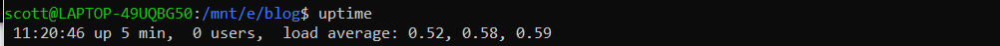
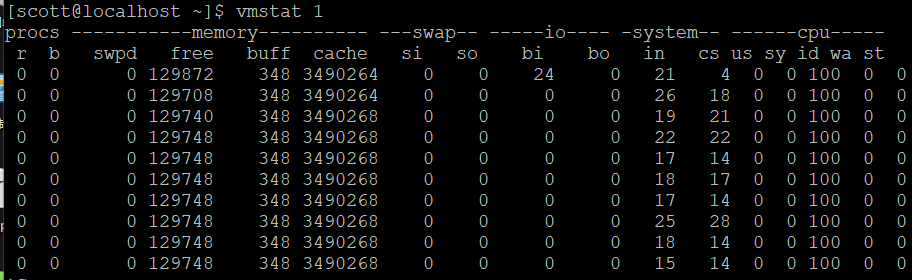
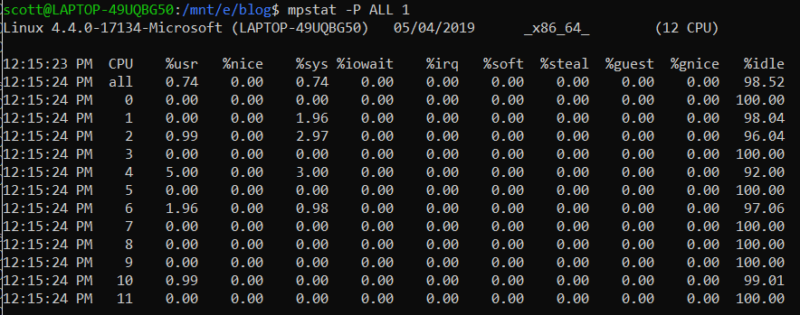
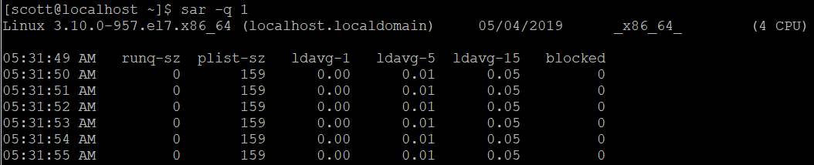
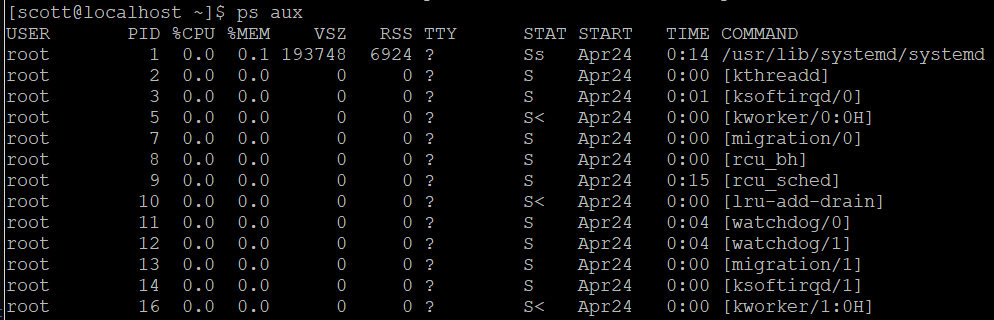

# CPU性能调优总结

## 1. 方法

| 方法         | 类型               |
| ------------ | ------------------ |
| 工具法       | 观察分析           |
| USE          | 观察分析，容量规划 |
| 负载特征归纳 | 观察分析           |
| 剖析         | 观察分析           |
| 周期分析     | 观察分析           |
| 性能监控     | 观察分析，容量规划 |
| 静态性能调优 | 观察分析，容量规划 |
| 优先级调优   | 调优               |
| 资源控制     | 调优               |
| CPU绑定      | 调优               |
| 微基准测试   | 实验分析           |
| 扩展         | 容量规划，调优     |

建议按照以下顺序使用上述方法：性能监控，USE，剖析，微型基准测试，静态分析。

## 2. 分析工具

| Linux         | 描述                          |
| ------------- | ----------------------------- |
| uptime        | 平均负载                      |
| vmstat        | 包括系统范围的CPU平均负载     |
| mpstat        | 单个CPU统计信息               |
| sar           | 历史统计信息                  |
| ps            | 进程状态                      |
| top           | 监控每个进程/线程CPU用量      |
| pidstat       | 每个进程/线程CPU用量分解      |
| time          | 给一个命令计时，带CPU用量分解 |
| DTrace， perf | CPU剖析和跟踪                 |
| perf          | CPU性能计数器分析             |

### 2.1 uptime

uptime提供几个有用的信息，第一个是系统系统当前时间和启动以来的时间，第二个是 平均负载。这里关注平均负载：

`load average: 0.52, 0.58, 0.59`

这三个数值代表系统1分钟，5分钟，15分钟的负载。平均负载大于CPU数量表示CPU不足以服务线程，有线程在runqueue里等待。如果小于CPU数量，则代表还有一些余量，线程可以在他们想要的时间在CPU上运行。

 但是目前Linux把在不可中断状态执行磁盘I/O的任务也计入了平均负载。这意味着平均负载再也不能单用来表示CPU余量或者饱和度，因为不能单从这个值推断出CPU或者磁盘负载。由于负载可能在CPU和磁盘之间不断变化，比较这三个平均负载数值也变得困难了。

在Linux上最好通过其它一些指标了解CPU负载，例如vmstate和mpstat。

### 2.2 vmstate

* r：运行队列长度
* us：用户态时间
* sy：内核态时间
* id：空闲时间
* wa：等待IO的时间
* st：CPU在虚拟化的环境下其它租户上的开销

CPU真正干活的时间是 **us + sy** 的时间，空闲的时间是  **wa + id **。

### 2.3 mpstat

mpstat能报告每个CPU的统计信息。使用**-P ALL**选项打印所有CPU的统计信息，可以手动指定打印间隔的时间。如下为每秒打印一次。

输出列：

* CPU：CPU逻辑ID，第一行为所有CPU的总结信息
* %usr：用户态时间
* %nice：以nice优先级运行的进程的用户态时间
* %sys：系统态时间
* %iowait：等待IO的时间
* %irq：硬件中断的处理程序占用的时间
* %soft：软中断CPU用量
* %steal：耗费在服务其它租户的时间
* %guest：耗费在访客虚拟机的时间
* %gnice：访客虚拟机nice级别进程所花费的时间
* %idle：空闲时间

嵌入式中不用关心虚拟化相关参数。CPU不干活的时间：**iowait + idle**。

### 2.4 sar - 系统活动报告器

用法

* -P ALL 与mpstate结果相同

* -q 包括运行队列长度等信息

    * runq-sz：运行队列长度
    * plist-sz：任务队列中的任务数
    * 中间三列分别为1，5，15分钟的平均负载
    * blocked：等待 IO完成的线程数

    

### 2.5 ps - process status

用于查看进程状态

CPU用量主要看 **%CPU** 和 **TIME** 这两列。

* %CPU：进程在前一秒内在所有CPU上的CPU用量之和，假设系统有4个CPU，然后进程中的所有线程完全占满CPU，则对于单线程进程，这里是100%，如果是双线程进程，这里是200%。
* TIME：进程从创建开始消耗的CPU总时间。

### 2.6 top

​		top输出信息较多，有系统启动时间，平均负载，CPU用量分布，进程/线程状态等信息。但是top本身会消耗较多CPU，因为其获得的信息是通过不断调用open(), read(), close()这几个系统调用来遍历 /proc 下存储进程相关信息的文件来实现的。

​		top可能会错过一些寿命较短的进程。Linux上可以通过 **atop** 来获得那些可能被 top 忽略的短命进程。

